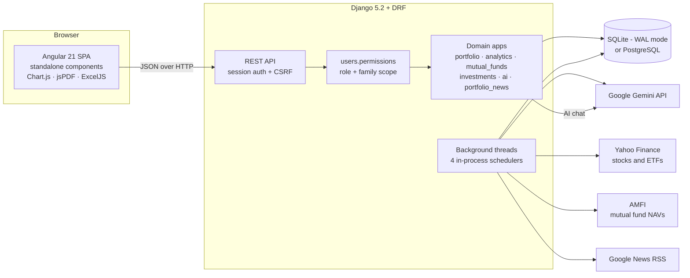
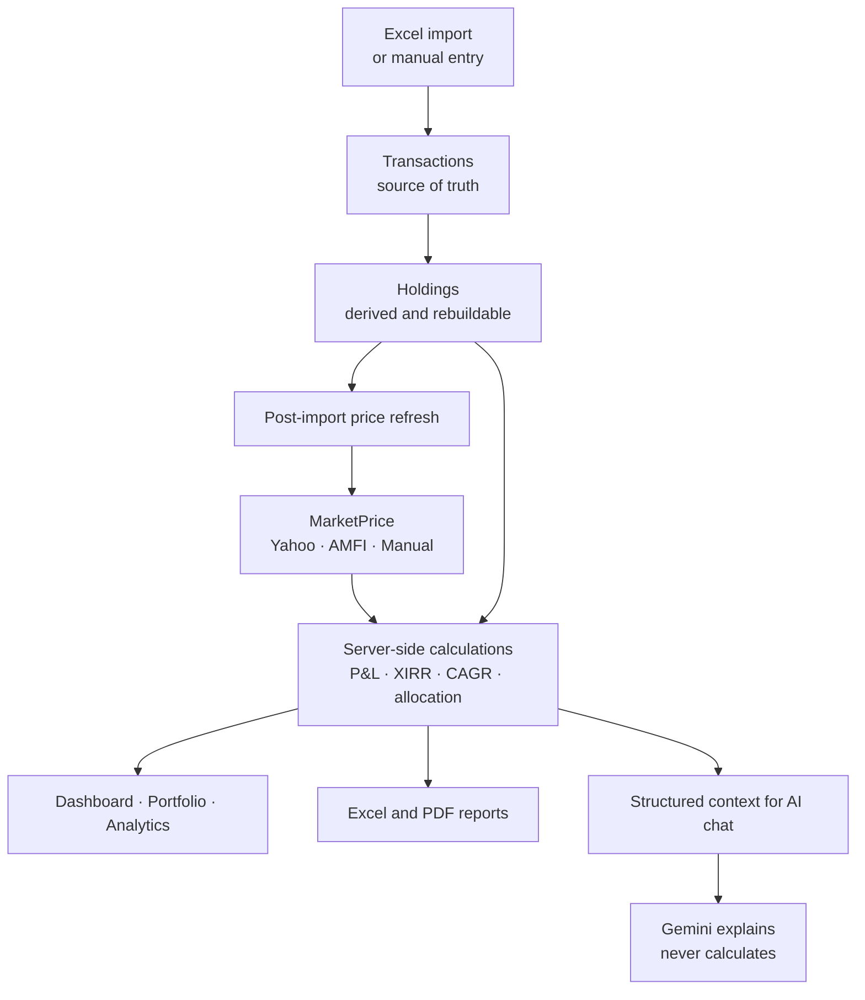
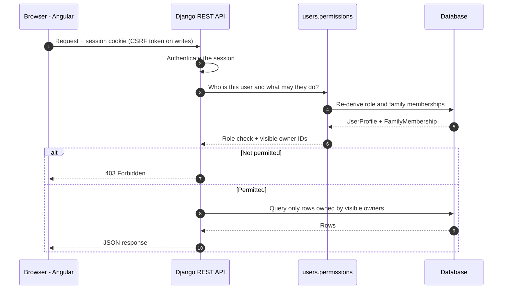
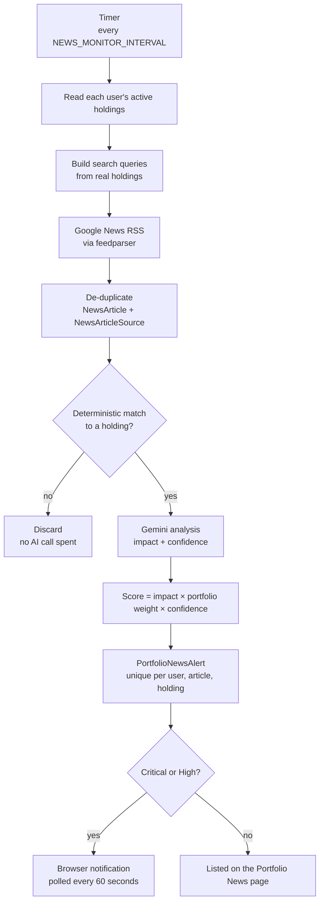
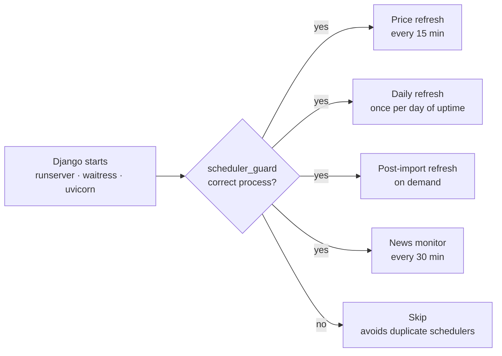
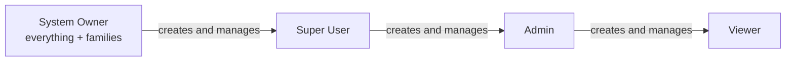
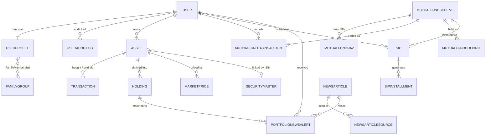

<div align="center">


# 💰 Personal Wealth Monitoring System

### Your family's entire portfolio. Real numbers. One place.

**A self-hosted wealth tracker for Indian investors** — stocks, ETFs, bonds, Sovereign Gold Bonds, mutual funds and SIPs — with true **XIRR**, live prices, role-based family sharing, and an AI-assisted news layer that never makes up a number.


[🚀 Quick start](#-quick-start) &nbsp;·&nbsp; [✨ Features](#-features) &nbsp;·&nbsp; [🧭 How it works](#-how-it-works) &nbsp;·&nbsp; [🔑 Roles](#-roles-and-permissions) &nbsp;·&nbsp; [🔌 API](#-api-reference) &nbsp;·&nbsp; [📘 Setup guide](./SETUP.md)

</div>

---

## 📑 Table of contents

|                                                     |                                                   |                                                                            |
| --------------------------------------------------- | ------------------------------------------------- | -------------------------------------------------------------------------- |
| [🌟 Overview](#-overview)                           | [🧰 Tech stack](#-tech-stack)                     | [🔧 Configuration](#-configuration)                                        |
| [🚀 Quick start](#-quick-start)                     | [📂 Repository structure](#-repository-structure) | [📜 Management commands](#-management-commands)                            |
| [✨ Features](#-features)                           | [🧱 Backend architecture](#-backend-architecture) | [🔒 Security model and privacy](#-security-model-and-privacy)              |
| [🧭 How it works](#-how-it-works)                   | [🧬 Data model](#-data-model)                     | [✅ Testing](#-testing)                                                    |
| [🔑 Roles and permissions](#-roles-and-permissions) | [🔌 API reference](#-api-reference)               | [🚧 Known limitations](#-known-limitations)                                |
| [🎨 Frontend architecture](#-frontend-architecture) | [⏰ Background jobs](#-background-jobs)           | [🤝 Contributing](#-contributing) · [📄 License](#-license-and-disclaimer) |

---

## 🌟 Overview

**PWMS** is a full-stack **personal and family wealth management system** for investors who hold **Indian equities, ETFs, bonds, Sovereign Gold Bonds (SGBs), mutual funds and SIPs** and want one place that _computes_ the numbers instead of estimating them.

Every figure you see — holdings, invested value, current value, unrealized and realized P&L, **XIRR**, **CAGR** and asset allocation — is calculated **server-side from your real transactions**. Prices stay fresh through automatic background refreshes (**Yahoo Finance** for stocks and ETFs, **AMFI** for mutual-fund NAVs), and the AI layer sitting on top of it never invents or recalculates anything.

It is built for **households, not just individuals**: a four-tier role hierarchy (System Owner / Super User / Admin / Viewer) plus many-to-many family membership lets several people share visibility into the same portfolio — or several portfolios — with permissions enforced independently on the backend, not merely hidden in the UI.

### At a glance

|     | Highlight                     | What it means                                                                                 |
| --- | ----------------------------- | --------------------------------------------------------------------------------------------- |
| 📈  | **Real returns**              | XIRR, CAGR and realized / unrealized P&L computed from actual transactions                    |
| 🇮🇳  | **Built for India**           | Stocks, ETFs, bonds, SGBs, mutual funds and SIPs; Yahoo Finance + AMFI data                   |
| 👨‍👩‍👧  | **Family-ready**              | Four roles, many-to-many families, and an active-family switcher                              |
| 🤖  | **AI on a leash**             | Gemini explains the numbers it is handed — it never computes them                             |
| 📰  | **News that matters**         | An agent reads your _actual_ holdings, matches articles deterministically, then scores impact |
| 🪶  | **Zero infrastructure tax**   | SQLite by default, in-process schedulers — no Celery, no Redis, no cron                       |
| 📤  | **Export anything**           | Transactions, holdings and summaries to Excel or PDF                                          |
| 🔐  | **Backend-enforced security** | Every request re-derives role and family scope from the database                              |

### Design principles

1. **Numbers are computed, never guessed.** The AI layer only interprets figures the backend hands it.
2. **Transactions are the source of truth.** Holdings are derived and can be rebuilt at any time.
3. **The server decides who can do what.** The UI hides controls for convenience; the API blocks them for real.
4. **Role and family are separate ideas.** Role controls what you can _do_; family membership controls whose data you can _see_.
5. **Run it anywhere, simply.** One Django process, one Angular app, one database file to start.

---

## 🚀 Quick start

> Full walkthrough with troubleshooting: **[SETUP.md](./SETUP.md)**. Prerequisites: Git, Python 3.12 (3.11+), Node.js 20+ (22 recommended).

**1 — Clone**

```bash
git clone https://github.com/avviiiral/Personal_Wealth_Monitoring_System.git
cd Personal_Wealth_Monitoring_System
```

**2 — Backend** (terminal 1)

<details open>
<summary><b>Windows (PowerShell)</b></summary>

```powershell
cd backend
python -m venv venv
.\venv\Scripts\Activate.ps1
python -m pip install --upgrade pip
python -m pip install -r requirements.txt

# Minimal local .env (optional Gemini key enables AI Chat + Portfolio News)
@"
DEBUG=True
GEMINI_API_KEY=paste-your-key-here
"@ | Set-Content .env

python manage.py migrate
python manage.py createsuperuser
python manage.py runserver
```

</details>

<details>
<summary><b>macOS / Linux</b></summary>

```bash
cd backend
python3 -m venv venv
source venv/bin/activate
python -m pip install --upgrade pip
python -m pip install -r requirements.txt

# Minimal local .env (optional Gemini key enables AI Chat + Portfolio News)
printf 'DEBUG=True\nGEMINI_API_KEY=paste-your-key-here\n' > .env

python manage.py migrate
python manage.py createsuperuser
python manage.py runserver
```

</details>

**3 — Frontend** (terminal 2)

```bash
cd frontend
npm install
npm start
```

**4 — Open the app**

| Service             | URL                               |
| ------------------- | --------------------------------- |
| 🌐 Web app          | http://localhost:4200             |
| ⚙️ API health check | http://127.0.0.1:8000/api/health/ |

Log in with the account you just created, open **Portfolio → Import** and load your transactions workbook.

> 💡 **Local `.env` tip:** `backend/.env.example` is a _production-style_ template (HTTPS redirect, secure cookies). Do not copy it unchanged for local development — browsers reject `Secure` cookies over plain `http://localhost`, which breaks login. Use the minimal `.env` above, or see [SETUP.md](./SETUP.md#43-create-your-env-file).

<!--
📸 SCREENSHOTS — add your own images to docs/ and uncomment this block.

## 📸 Screenshots

| Dashboard | Portfolio tree |
|---|---|
|  |  |

| Analytics | AI chat | Portfolio news |
|---|---|---|
|  |  |  |
-->

---

## ✨ Features

### 📊 Dashboard

Net worth, asset allocation, key portfolio metrics and an **Investment Summary** table broken down by asset class — all computed server-side and scoped to your own data plus your currently active family's data (or everyone's, for a System Owner).

### 📁 Portfolio

- A hierarchical tree of holdings: **Family → Portfolio → Asset class → Sub-class → Asset**
- Quantity, invested value, current value, P&L and **XIRR per node**
- Full transaction history, create / edit / delete
- **Excel transaction import** (a _Transactions_ sheet is required; a _Summary_ sheet is optional)
- Inline **manual price override** for Admin and above, for any asset in your visible family scope

### 📈 Analytics

- Wealth allocation by **asset class, sector, market cap, AMC and advisor**
- Performance ranking and portfolio **XIRR**
- **Historical wealth** over any date range
- Dedicated **equity** and **fixed-income** breakdowns

### 🏦 Mutual funds and SIPs

- Scheme holdings with **NAV-based valuation** (AMFI feed)
- Mutual-fund transaction recording
- **SIP creation**, due / overdue tracking and **per-installment execution**
- SIPs are synced and executed automatically by the daily job

### 📄 Reports

Export **transactions, holdings and portfolio summaries** to **Excel or PDF** — matching exactly what the Portfolio and Dashboard pages show.

### 🔐 Settings

- **Account and preferences**, including password change
- **User Management** — role-scoped: you only see and manage the roles you're allowed to
- **Family Management** — System Owner only
- **Manual Prices** — override any asset's price within your visible family scope; every override is **audit-logged** (who, when, from what)

### 🤖 AI Portfolio Chat

A **Gemini-backed** assistant scoped to the logged-in user's own portfolio. The backend builds a structured context (holdings, allocation, recent performance) and hands it to Gemini. **Gemini interprets the numbers it is given — it never computes or invents them.** Token usage is logged per call.

### 📰 Portfolio News Intelligence

A background agent that:

1. reads each user's **actual holdings** (there is no hard-coded stock list),
2. searches **Google News RSS** (no paid news API),
3. **deterministically matches** articles to holdings _before_ spending any AI call,
4. scores each alert by **`impact × portfolio_weight × confidence`**,
5. raises a **browser notification** for Critical / High items.

It is fully automatic — no scheduled task, no `.bat` file, nothing to configure beyond a Gemini key.

---

## 🧭 How it works

### 1 · System architecture



### 2 · From transactions to insight



### 3 · Request lifecycle and authorization

Nothing trusts a role or family ID claimed by the client — every check is re-derived from the database on every request.



### 4 · Portfolio News agent pipeline



### 5 · Scheduler start-up



---

## 🔑 Roles and permissions

Four hierarchical roles are enforced on **every request** by one centralized permission service ([`backend/users/permissions.py`](./backend/users/permissions.py)). The frontend hides controls for convenience; the backend independently blocks anything unauthorized, no matter what the UI shows.

```
VIEWER  <  ADMIN  <  SUPER_USER  <  SYSTEM_OWNER
```



> **Role ≠ family.** Role decides what a user can **do**. Family membership decides whose data they can **see**. The two are deliberately never inferred from one another.

### Permission matrix

| Capability                                                                     | 👁️ Viewer | 🛠️ Admin | ⭐ Super User | 👑 System Owner |
| ------------------------------------------------------------------------------ | :-------: | :------: | :-----------: | :-------------: |
| Log in                                                                         |    ✅     |    ✅    |      ✅       |       ✅        |
| View permitted portfolio data (Dashboard, Portfolio, Analytics, AI Chat, News) |    ✅     |    ✅    |      ✅       |       ✅        |
| Edit own profile                                                               |    ✅     |    ✅    |      ✅       |       ✅        |
| Edit manual prices (family-shared)                                             |    ❌     |    ✅    |      ✅       |       ✅        |
| Create a Viewer                                                                |    ❌     |    ✅    |      ✅       |       ✅        |
| Create an Admin                                                                |    ❌     |    ❌    |      ✅       |       ✅        |
| Create a Super User or System Owner                                            |    ❌     |    ❌    |      ❌       |       ✅        |
| Manage Viewers ¹                                                               |    ❌     |    ✅    |      ✅       |       ✅        |
| Manage Admins ¹                                                                |    ❌     |    ❌    |      ✅       |       ✅        |
| Manage Super Users / System Owners ¹                                           |    ❌     |    ❌    |      ❌       |       ✅        |
| Change another user's role ²                                                   |    ❌     |    ❌    |    Limited    |       ✅        |
| Create / manage families and memberships                                       |    ❌     |    ❌    |      ❌       |       ✅        |
| Assign a user to multiple families                                             |    ❌     |    ❌    |      ❌       |       ✅        |
| View every family's data                                                       |    ❌     |    ❌    |      ❌       |       ✅        |

¹ _Manage_ = edit, activate, deactivate, delete and reset password. Account management is scoped **by role only** — family membership never gates it.
² A Super User may only move accounts between **Admin** and **Viewer**, and only when the target is currently Admin or Viewer. Nobody — including the System Owner — can change their **own** role (privilege-escalation guard), and the last active System Owner can never be demoted.

### What each user can see

| Role               | Visible portfolio data                                                    |
| ------------------ | ------------------------------------------------------------------------- |
| **System Owner**   | Every user in the system, across all families                             |
| **Everyone else**  | Their own data **plus** every member of their **currently active family** |
| No family assigned | Only their own data                                                       |

A user may belong to **zero, one or many** families. A personal **active-family selector** scopes every data screen to one family at a time — a combined view of several families is deliberately not shown.

> [!NOTE]
> `Asset` and `Transaction` records are still stored against a single owning user account. Family-shared _visibility_ is layered on top through the authorization helpers in `users/permissions.py`, not by changing the ownership field.

---

## 🧰 Tech stack

| Layer                 | Technology                                                                                                                               |
| --------------------- | ---------------------------------------------------------------------------------------------------------------------------------------- |
| Backend framework     | Django 5.2 + Django REST Framework 3.18                                                                                                  |
| Backend language      | Python 3.12                                                                                                                              |
| Database              | SQLite by default (WAL journal mode + busy-timeout for scheduler concurrency); **PostgreSQL** supported via `DATABASE_ENGINE=postgresql` |
| Production serving    | `runserver` for development; **waitress** (WSGI) or **uvicorn** (ASGI) for production                                                    |
| Authentication        | Django session authentication (cookie + CSRF)                                                                                            |
| Frontend framework    | Angular 21 — standalone components, no NgModules                                                                                         |
| Frontend language     | TypeScript                                                                                                                               |
| Charts                | Chart.js / ng2-charts                                                                                                                    |
| Excel import / export | `openpyxl` (backend), `exceljs` (frontend)                                                                                               |
| PDF export            | `jspdf` + `jspdf-autotable` (frontend)                                                                                                   |
| Market data           | Yahoo Finance (`yfinance` + `curl_cffi`), AMFI NAV feed over HTTP                                                                        |
| News retrieval        | Google News RSS via `feedparser` — no paid news API                                                                                      |
| AI                    | Google Gemini REST API                                                                                                                   |
| Background scheduling | In-process Python threads — **no Celery, no Redis**                                                                                      |
| Logging               | Centralized rotating file handler (`backend/logs/pwms.log`)                                                                              |

---

## 📂 Repository structure

```
Personal_Wealth_Monitoring_System/
├── backend/
│   ├── manage.py
│   ├── requirements.txt
│   ├── .env.example            Template for every deployment-sensitive setting
│   ├── config/                 Settings (env-driven), scheduler_guard.py, root urls.py, WSGI/ASGI
│   ├── api/                    Health check, login / logout, profile settings
│   ├── users/                  RBAC: 4-tier roles, FamilyGroup, FamilyMembership,
│   │                           UserAuditLog, centralized permissions.py
│   ├── investments/            Asset, Transaction, Holding, SecurityMaster,
│   │                           Excel importer, AMC-name / quant enrichment
│   ├── market_data/            MarketPrice, price providers, background scheduler
│   ├── portfolio/              Portfolio tree / summary / holdings / transactions APIs
│   ├── mutual_funds/           Schemes, NAVs, MF transactions, SIPs, MF holdings
│   ├── analytics/              Wealth / allocation / performance / XIRR analytics
│   ├── ai/                     Gemini portfolio chat, Gemini usage tracking
│   ├── portfolio_news/         News discovery, matching, de-duplication, alert scoring
│   └── data/
│       ├── security_master.xlsx            Reference security data
│       └── security_master_lookups.json    Researched sector / AMC / ratio data
│
├── frontend/
│   ├── package.json · angular.json
│   └── src/
│       ├── environments/       environment.ts (dev) and environment.prod.ts
│       │                       (swapped at build time) — the ONE place the API URL is set
│       ├── app/                Shell, layout (sidebar / header with family switcher), routing
│       ├── core/
│       │   ├── services/       One API client per backend area + RBAC service
│       │   └── guards/         auth.guard (also loads the RBAC role)
│       ├── features/
│       │   ├── dashboard/  portfolio/  analytics/  reports/
│       │   ├── ai-chat/  portfolio-news/  login/
│       │   └── settings/
│       │       ├── user-management/
│       │       ├── family-management/
│       │       └── manual-prices/
│       └── shared/
│
├── docs/                       Supporting documentation and assets
├── README.md                   You are here
├── SETUP.md                    Step-by-step install guide
├── License.md
└── .gitignore
```

---

## 🧱 Backend architecture

Each Django app owns one area of the domain and is mounted under a fixed prefix in `backend/config/urls.py`:

| App            | URL prefix                  | Responsibility                                                               |
| -------------- | --------------------------- | ---------------------------------------------------------------------------- |
| `api`          | `/api/`                     | Health check, login / logout / current user, profile settings                |
| `users`        | `/api/settings/`            | RBAC, user management, family management                                     |
| `portfolio`    | `/api/portfolio/`           | Assets, transactions, portfolio tree / summary / holdings, manual price edit |
| `analytics`    | `/api/analytics/`           | Wealth allocation, performance, XIRR, historical analytics                   |
| `mutual_funds` | `/api/mutual-funds/`        | Schemes, MF transactions, MF holdings, SIPs                                  |
| `market_data`  | _(internal + stock search)_ | Price providers, background price refresh                                    |
| `ai`           | `/api/ai/`                  | Portfolio chat; also mounts `portfolio_news` URLs                            |
| `investments`  | `/api/investments/`         | Excel transaction import, Security Master                                    |

**`users.permissions` is the single authorization service** — role-rank helpers, family-scope helpers (`get_visible_owner_ids`, `get_manageable_users_queryset`) and reusable DRF permission classes (`IsViewer`, `IsAdmin`, `IsSuperUser`, `IsSystemOwner`, `IsAdminOrSuperUser`). Its docstring holds the canonical permission matrix — keep it in sync with the table in this README.

---

## 🧬 Data model



_A simplified conceptual view — see each app's `models.py` for exact fields and constraints._

| App              | Models                                                                                                     | Notes                                                                                                                                                                                           |
| ---------------- | ---------------------------------------------------------------------------------------------------------- | ----------------------------------------------------------------------------------------------------------------------------------------------------------------------------------------------- |
| `users`          | `UserProfile`, `FamilyGroup`, `FamilyMembership`, `UserAuditLog`                                           | `UserProfile` holds role and active family; the audit log is append-only                                                                                                                        |
| `investments`    | `Asset`, `Transaction`, `Holding`, `SecurityMaster`                                                        | `Transaction` is the source of truth for quantity and invested value; `Holding` is derived and rebuildable; `SecurityMaster` stores sector, cap-type, AMC name, P/E, P/B, ROE and credit rating |
| `market_data`    | `MarketPrice`                                                                                              | Tagged by source: **Yahoo Finance**, **AMFI** or **Manual**                                                                                                                                     |
| `mutual_funds`   | `MutualFundScheme`, `MutualFundNAV`, `MutualFundTransaction`, `MutualFundHolding`, `SIP`, `SIPInstallment` |                                                                                                                                                                                                 |
| `portfolio_news` | `NewsArticle`, `NewsArticleSource`, `PortfolioNewsAlert`                                                   | Alerts are unique per user / article / holding                                                                                                                                                  |
| `ai`             | `GeminiUsageLog`                                                                                           | Token usage per Gemini call — chat and news agent alike                                                                                                                                         |

---

## 🔌 API reference

All endpoints require an authenticated Django session unless noted. Auth uses **session cookie + CSRF token** (no bearer tokens).

<details open>
<summary><b>Auth and profile</b> — <code>/api/</code></summary>

| Method | Endpoint                         | Purpose                      |
| ------ | -------------------------------- | ---------------------------- |
| `GET`  | `/api/health/`                   | Health check _(no auth)_     |
| `POST` | `/api/auth/login/`               | Log in (starts a session)    |
| `POST` | `/api/auth/logout/`              | Log out                      |
| `GET`  | `/api/auth/me/`                  | Current user                 |
| `GET`  | `/api/settings/`                 | Account settings             |
| `POST` | `/api/settings/update/`          | Update profile / preferences |
| `POST` | `/api/settings/change-password/` | Change own password          |

</details>

<details>
<summary><b>RBAC, users, families and manual prices</b> — <code>/api/settings/</code></summary>

| Method                       | Endpoint                                         | Purpose                              |
| ---------------------------- | ------------------------------------------------ | ------------------------------------ |
| `GET`                        | `/api/settings/me/`                              | Current user's role and family state |
| `POST`                       | `/api/settings/me/active-family/`                | Switch the active family             |
| `GET` `POST`                 | `/api/settings/users/`                           | List / create users (role-scoped)    |
| `GET` `PUT` `PATCH` `DELETE` | `/api/settings/users/<id>/`                      | Retrieve / update / delete a user    |
| `POST`                       | `/api/settings/users/<id>/activate/`             | Activate a user                      |
| `POST`                       | `/api/settings/users/<id>/deactivate/`           | Deactivate a user                    |
| `POST`                       | `/api/settings/users/<id>/reset-password/`       | Reset a user's password              |
| `GET` `POST`                 | `/api/settings/groups/`                          | List / create families               |
| `PATCH` `DELETE`             | `/api/settings/groups/<id>/`                     | Update / delete a family             |
| `POST` `DELETE`              | `/api/settings/groups/<id>/members/[<user_id>/]` | Add / remove a family member         |
| `GET`                        | `/api/settings/prices/`                          | List overridable prices              |
| `PUT` `PATCH` `DELETE`       | `/api/settings/prices/<asset_id>/`               | Set / clear a manual price           |

</details>

<details>
<summary><b>Portfolio</b> — <code>/api/portfolio/</code></summary>

| Method                       | Endpoint                                   | Purpose                                  |
| ---------------------------- | ------------------------------------------ | ---------------------------------------- |
| `GET` `POST`                 | `/api/portfolio/assets/`                   | List / create assets                     |
| `GET` `PUT` `PATCH` `DELETE` | `/api/portfolio/assets/<id>/`              | Retrieve / update / delete an asset      |
| `GET` `POST`                 | `/api/portfolio/transactions/`             | List / create transactions               |
| `GET` `PUT` `PATCH` `DELETE` | `/api/portfolio/transactions/<id>/`        | Retrieve / update / delete a transaction |
| `GET`                        | `/api/portfolio/summary/`                  | Portfolio summary                        |
| `GET`                        | `/api/portfolio/holdings/`                 | Holdings                                 |
| `GET`                        | `/api/portfolio/tree/`                     | Hierarchical portfolio tree              |
| `PUT` `PATCH` `DELETE`       | `/api/portfolio/assets/<id>/manual-price/` | Manual price override                    |

</details>

<details>
<summary><b>Analytics</b> — <code>/api/analytics/</code></summary>

| Method | Endpoint                                       |
| ------ | ---------------------------------------------- |
| `GET`  | `/api/analytics/wealth/summary/`               |
| `GET`  | `/api/analytics/wealth/allocation/`            |
| `GET`  | `/api/analytics/wealth/performance/`           |
| `GET`  | `/api/analytics/wealth/xirr/`                  |
| `GET`  | `/api/analytics/wealth/investment-summary/`    |
| `GET`  | `/api/analytics/wealth/sector-allocation/`     |
| `GET`  | `/api/analytics/wealth/market-cap-allocation/` |
| `GET`  | `/api/analytics/wealth/equity-analysis/`       |
| `GET`  | `/api/analytics/wealth/fixed-income-analysis/` |
| `GET`  | `/api/analytics/wealth/historical/`            |

</details>

<details>
<summary><b>Mutual funds and SIPs</b> — <code>/api/mutual-funds/</code></summary>

| Method | Endpoint                                           | Purpose                  |
| ------ | -------------------------------------------------- | ------------------------ |
| `GET`  | `/api/mutual-funds/summary/`                       | MF summary               |
| `GET`  | `/api/mutual-funds/holdings/`                      | MF holdings              |
| `GET`  | `/api/mutual-funds/transactions/`                  | MF transactions          |
| `POST` | `/api/mutual-funds/transactions/create/`           | Record an MF transaction |
| `GET`  | `/api/mutual-funds/schemes/`                       | Scheme list              |
| `GET`  | `/api/mutual-funds/sips/`                          | SIPs                     |
| `GET`  | `/api/mutual-funds/sips/due/`                      | Due / overdue SIPs       |
| `POST` | `/api/mutual-funds/sips/create/`                   | Create a SIP             |
| `POST` | `/api/mutual-funds/sip-installments/<id>/execute/` | Execute one installment  |

</details>

<details>
<summary><b>Investments, AI and news</b> — <code>/api/investments/</code>, <code>/api/ai/</code></summary>

| Method        | Endpoint                                 | Purpose                               |
| ------------- | ---------------------------------------- | ------------------------------------- |
| `POST`        | `/api/investments/import/`               | Import transactions from Excel        |
| `GET`         | `/api/investments/security-master/`      | Security Master list                  |
| `GET` `PATCH` | `/api/investments/security-master/<id>/` | Retrieve / edit a Security Master row |
| `POST`        | `/api/ai/chat/`                          | Portfolio chat (Gemini)               |
| `GET`         | `/api/ai/news/`                          | Portfolio news alerts                 |
| `GET`         | `/api/ai/notifications/`                 | Notification feed                     |
| `POST`        | `/api/ai/notifications/<alert_id>/read/` | Mark an alert as read                 |

</details>

---

## 🎨 Frontend architecture

- **Standalone Angular components** throughout — no `NgModule`s.
- `core/services/rbac.service.ts` is the single source of role / permission / family state. It hides controls, but every action is still independently authorized by the backend.
- **One API client service per backend area** under `core/services/`, each reading its base URL from `environment.apiUrl` — nothing hardcodes a host.
- `core/services/browser-notification.service.ts` shows native browser notifications for new **Critical / High** news alerts, polled every **60 seconds**.
- `auth.guard` protects every route and loads the RBAC role before rendering.

| Route             | Screen                                                        |
| ----------------- | ------------------------------------------------------------- |
| `/login`          | Sign in                                                       |
| `/dashboard`      | Net worth, allocation, investment summary                     |
| `/portfolio`      | Holdings tree, transactions, import, manual price override    |
| `/analytics`      | Allocation, performance, XIRR, historical wealth              |
| `/reports`        | Excel / PDF exports                                           |
| `/ai-chat`        | Gemini portfolio assistant                                    |
| `/portfolio-news` | News alerts for your holdings                                 |
| `/settings`       | Account · User Management · Family Management · Manual Prices |

All authenticated routes sit under a `ShellComponent` (sidebar + header with the family switcher).

---

## ⏰ Background jobs

Four independent, **in-process** mechanisms start automatically from each app's `AppConfig.ready()`. They deliberately avoid Celery / Redis, and [`config/scheduler_guard.py`](./backend/config/scheduler_guard.py) detects whether Django is running under `runserver`, **waitress** or **uvicorn** so each job starts **exactly once** however the server is launched.

| #   | Job                        | Cadence                                        | What it does                                                      |
| --- | -------------------------- | ---------------------------------------------- | ----------------------------------------------------------------- |
| 1   | **Market price refresh**   | Every 15 minutes                               | Stock / ETF prices (Yahoo Finance) and mutual-fund NAVs (AMFI)    |
| 2   | **Daily refresh**          | Once per calendar day of uptime                | AMFI NAV, security-master ratios, SIP sync and execute            |
| 3   | **Post-import refresh**    | Right after an import commits                  | Immediate live price for any newly added asset                    |
| 4   | **Portfolio News monitor** | Every `NEWS_MONITOR_INTERVAL` (default 30 min) | Full news discovery → match → analyze → alert pass for every user |

There is no Task Scheduler entry, cron job or `.bat` file to configure — the jobs run for exactly as long as the server process is up. Check `backend/logs/pwms.log` to watch them work.

---

## 🔧 Configuration

Settings load from **`backend/.env`** (template: [`backend/.env.example`](./backend/.env.example)). Every value has a development-safe default baked into `config/settings.py`, so **local development works with no `.env` at all**; you only need real values for a deployment.

| Variable                                                                                  | Purpose                                                     | Local default                               | Production / template value                                                                                   |
| ----------------------------------------------------------------------------------------- | ----------------------------------------------------------- | ------------------------------------------- | ------------------------------------------------------------------------------------------------------------- |
| `SECRET_KEY`                                                                              | Django's cryptographic signing key                          | insecure placeholder                        | A random key — never committed                                                                                |
| `DEBUG`                                                                                   | Debug mode                                                  | `True`                                      | `False`                                                                                                       |
| `ALLOWED_HOSTS`                                                                           | Comma-separated allowed hosts                               | _(empty)_                                   | Your domain(s) / IP(s) — Django rejects everything else once `DEBUG=False`                                    |
| `CORS_ALLOWED_ORIGINS`                                                                    | Allowed frontend origins                                    | `http://localhost:4200`                     | Exact `https://` origin of the frontend                                                                       |
| `CSRF_TRUSTED_ORIGINS`                                                                    | Trusted origins for CSRF                                    | `http://localhost:4200`                     | Same as above                                                                                                 |
| `SESSION_COOKIE_SECURE`                                                                   | Require HTTPS for the session cookie                        | `False`                                     | `True` — only once real HTTPS is in place                                                                     |
| `CSRF_COOKIE_SECURE`                                                                      | Require HTTPS for the CSRF cookie                           | `False`                                     | `True` — only once real HTTPS is in place                                                                     |
| `SECURE_SSL_REDIRECT`                                                                     | Redirect HTTP → HTTPS                                       | `False`                                     | `True`                                                                                                        |
| `DATABASE_ENGINE`                                                                         | `sqlite` or `postgresql`                                    | `sqlite`                                    | `sqlite` until your PostgreSQL migration is validated                                                         |
| `POSTGRES_DB` · `POSTGRES_USER` · `POSTGRES_PASSWORD` · `POSTGRES_HOST` · `POSTGRES_PORT` | PostgreSQL connection                                       | used only when `DATABASE_ENGINE=postgresql` | template: `pwms` · `pwms_user` · _(set a password)_ · `localhost` · `5432`                                    |
| `GEMINI_API_KEY` _(or `GOOGLE_API_KEY`)_                                                  | Enables AI Chat and Portfolio News analysis                 | —                                           | Your key from Google AI Studio. Without it those features log a warning and skip analysis rather than failing |
| `NEWS_MONITOR_INTERVAL`                                                                   | Seconds between automatic news runs                         | `1800`                                      | Tune as needed                                                                                                |
| `NEWS_MONITOR_AI_CALL_DELAY_SECONDS`                                                      | Pause between Gemini calls in a news run                    | —                                           | Raise (e.g. `6`) if you hit rate-limit errors                                                                 |
| `WATCHLIST_PMS_SOURCE_URLS`                                                               | Optional comma-separated authoritative PMS source endpoints | _(blank)_                                   | Leave blank when no reliable source exists — no PMS values are ever fabricated                                |

> ⚠️ **Turn the `*_SECURE` flags and `SECURE_SSL_REDIRECT` on only after HTTPS is working.** Browsers refuse `Secure` cookies over plain HTTP, so enabling them early breaks login.

**Frontend:** the backend URL lives in exactly one place — `frontend/src/environments/environment.ts` (`apiUrl`, `http://localhost:8000` for development). Production builds automatically swap in `environment.prod.ts` via `fileReplacements` in `angular.json`.

---

## 📜 Management commands

Run from `backend/` with the virtual environment active: `python manage.py <command>`.

| Command                          | App              | What it does                                                                 |
| -------------------------------- | ---------------- | ---------------------------------------------------------------------------- |
| `update_market_prices`           | `market_data`    | One-off price refresh (also runs automatically every 15 min)                 |
| `monitor_portfolio_news`         | `portfolio_news` | One full news-monitoring pass for every user (also automatic)                |
| `gemini_usage`                   | `ai`             | Summary of Gemini token usage                                                |
| `fetch_amfi_nav`                 | `mutual_funds`   | Download and import the current AMFI NAV file (batched commits)              |
| `execute_sips`                   | `mutual_funds`   | Execute all due SIP installments for a user                                  |
| `rebuild_holdings`               | `portfolio`      | Rebuild holdings from transactions — `--user-id <id>`                        |
| `load_security_master_data`      | `investments`    | Load researched sector / cap-type / P/E / P/B / ROE data into SecurityMaster |
| `link_security_master`           | `investments`    | Link Assets to their SecurityMaster row by ISIN _(dry-run by default)_       |
| `import_amfi_cap_classification` | `investments`    | Classify stocks Large / Mid / Small Cap by AMFI rank _(dry-run by default)_  |

Standard Django commands you'll use as well: `migrate`, `check`, `createsuperuser`, `changepassword <username>`, `shell`, `test`.

> Tip: run any command with `--help` to see its options — including how to apply the _dry-run by default_ commands.

---

## 🔒 Security model and privacy

**Security**

- **Session auth + CSRF** — no long-lived bearer tokens to leak.
- **Server-side authorization on every request.** Role and family memberships are re-read from the database each time; a client-claimed role or family ID is never trusted.
- **Privilege-escalation guards** — nobody can change their own role; the last active System Owner cannot be demoted; missing profiles never grant access.
- **Audit trail** — user-management activity is written to an append-only audit log, and every manual price override is audit-logged (who, when, from what).
- **Secrets stay out of git** — `.env` is gitignored; only `.env.example` is committed.
- **Tested** — `users/tests.py` covers every role × capability combination and privilege-escalation attempt.

**What leaves your machine**

PWMS is self-hosted, so your database never leaves your server. The following outbound calls do happen:

| Destination         | When                      | What is sent                                                                                                            |
| ------------------- | ------------------------- | ----------------------------------------------------------------------------------------------------------------------- |
| **Yahoo Finance**   | Price refresh             | Ticker symbols for your Stock / ETF holdings                                                                            |
| **AMFI**            | NAV refresh               | Nothing personal — a public NAV file is downloaded                                                                      |
| **Google News RSS** | News monitor              | Search queries built from the securities you hold                                                                       |
| **Google Gemini**   | AI Chat and News analysis | Structured portfolio context (chat) and matched article / holding details (news). _Only if you configure a Gemini key._ |

Prefer to keep everything local? Leave `GEMINI_API_KEY` unset — every feature except AI Chat and Portfolio News analysis keeps working.

---

## ✅ Testing

**Backend** — from `backend/` with the virtual environment active:

```bash
python manage.py test                       # everything
python manage.py test users portfolio -v 2  # RBAC + portfolio, verbose
```

| Suite                   | Covers                                                                |
| ----------------------- | --------------------------------------------------------------------- |
| `users/tests.py`        | Every role × capability combination and privilege-escalation attempts |
| `mutual_funds/tests.py` | Batched AMFI NAV import                                               |
| `investments/tests.py`  | The transaction importer and AMC-name / quant auto-enrichment         |

**Frontend** — from `frontend/`:

```bash
npm test          # unit tests
npm run build     # verifies the whole app compiles
```

---

## 🚧 Known limitations

| Limitation                                   | Details                                                                                                                                                                                                 |
| -------------------------------------------- | ------------------------------------------------------------------------------------------------------------------------------------------------------------------------------------------------------- |
| **SQLite is the default database**           | WAL mode + busy-timeout reduce — but do not eliminate — write contention under concurrent load, and there is no automated backup yet. Fine for a household; for many concurrent writers use PostgreSQL. |
| **Schedulers assume one server process**     | If deployed behind multiple worker _processes_ (not threads), each process would start its own copy of every scheduler. Run a single process.                                                           |
| **Single owning user per record**            | `Asset` / `Transaction` are stored against one owning `User`; family sharing is a visibility layer on top.                                                                                              |
| **News notifications are polling, not push** | Browser notifications are polled every 60 seconds and only fire while the Angular app is open.                                                                                                          |
| **Some SIP tests drift with the calendar**   | A few SIP-scheduling tests compare against today's real date; this is a known fixture limitation that does not affect the running app.                                                                  |
| **Third-party data can lag or fail**         | Yahoo Finance, AMFI and Google News are external sources; use **manual prices** when a quote is missing.                                                                                                |

See [SETUP.md](./SETUP.md) for what to configure before any real deployment (`.env`, `environment.prod.ts` and the WSGI / ASGI options).

---

## 🤝 Contributing

Found a bug or have an idea? **Open an issue** on the [issue tracker](https://github.com/avviiiral/Personal_Wealth_Monitoring_System/issues). If you're proposing a change:

1. Create a feature branch from `main`.
2. Run `python manage.py test` (backend) and `npm run build` (frontend) before pushing.
3. If you touch roles or capabilities, update **both** the matrix in `backend/users/permissions.py` and the table in this README.
4. Keep every new endpoint behind the central permission classes — never trust client-supplied roles or family IDs.

---

## 📄 License and disclaimer

Released under a **proprietary license** — see [`License.md`](./License.md).

> **Disclaimer.** PWMS is a personal record-keeping and analytics tool. It is **not** investment, tax or legal advice. Prices and NAVs come from third-party sources and may be delayed, adjusted or unavailable, and AI-generated commentary can be wrong. Always reconcile against your broker, depository and AMC statements before making decisions. PWMS is not affiliated with Yahoo, AMFI, Google or any exchange.

---

<div align="center">

**Built by [@avviiiral](https://github.com/avviiiral)**

[⬆ Back to top](#-personal-wealth-monitoring-system)

</div>
