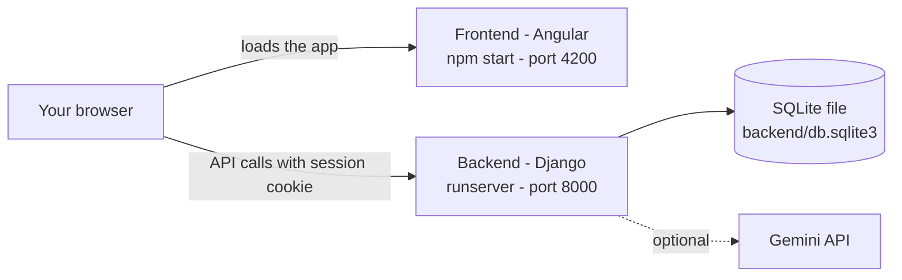
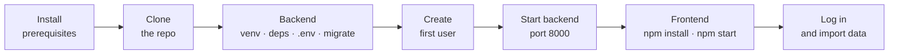
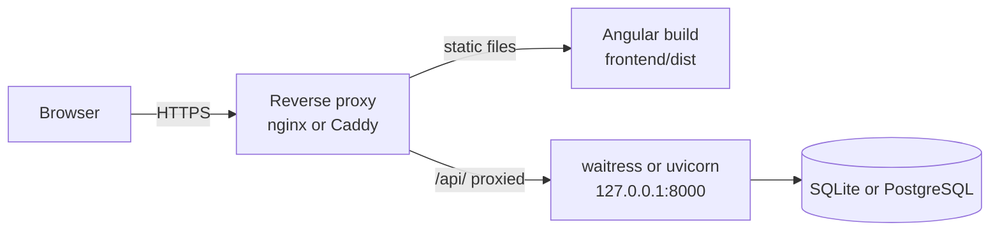

<div align="center">

# 🚀 PWMS Setup Guide

### From a brand-new machine to a running Personal Wealth Monitoring System

⏱️ **About 20 minutes** &nbsp;·&nbsp; 🧑‍💻 **No Django or Angular experience needed** &nbsp;·&nbsp; 🪟🍎🐧 **Windows · macOS · Linux**

[← Back to the README](./README.md)

</div>

---

This guide takes you from nothing installed to a working PWMS instance (backend + frontend) that you can log into, then covers importing data, everyday use, optional PostgreSQL, running it in a production-style setup, backups, and troubleshooting.

Commands are shown for **Windows (PowerShell)** first, with the **macOS / Linux** equivalent wherever it differs.

## 📑 Contents

|                                                                           |                                                                      |
| ------------------------------------------------------------------------- | -------------------------------------------------------------------- |
| [1 · What you're installing](#1--what-youre-installing)                   | [10 · Optional: PostgreSQL](#10--optional-postgresql)                |
| [2 · Prerequisites](#2--prerequisites)                                    | [11 · Production-style deployment](#11--production-style-deployment) |
| [3 · Get the code](#3--get-the-code)                                      | [12 · Updating PWMS](#12--updating-pwms)                             |
| [4 · Backend setup](#4--backend-setup)                                    | [13 · Backups and restore](#13--backups-and-restore)                 |
| [5 · Frontend setup](#5--frontend-setup)                                  | [14 · Running the tests](#14--running-the-tests)                     |
| [6 · First login, users and families](#6--first-login-users-and-families) | [15 · Troubleshooting](#15--troubleshooting)                         |
| [7 · Getting your data in](#7--getting-your-data-in)                      | [16 · Cheat sheet](#16--cheat-sheet)                                 |
| [8 · Background jobs](#8--background-jobs)                                | [17 · Reset or uninstall](#17--reset-or-uninstall)                   |
| [9 · Everyday startup](#9--everyday-startup)                              |                                                                      |

---

## 1 · What you're installing

PWMS is two programs that run side by side:

```
Backend  = Django (Python)   stores data, exposes the API, runs on  :8000
Frontend = Angular (Node.js) the website you use,            runs on  :4200
```

Both must be running at the same time — the website in your browser talks to the backend over HTTP.



**The whole journey at a glance**



---

## 2 · Prerequisites

| Tool                            | Version                                              | Used for                        | Verify with                                      |
| ------------------------------- | ---------------------------------------------------- | ------------------------------- | ------------------------------------------------ |
| **Git**                         | any recent                                           | Cloning the repository          | `git --version`                                  |
| **Python**                      | **3.12** recommended (3.11+ works)                   | Backend                         | `python --version`                               |
| **Node.js**                     | **22 LTS** recommended (20 LTS or newer should work) | Angular dev server and build    | `node --version`                                 |
| **npm**                         | ships with Node.js                                   | Frontend packages               | `npm --version`                                  |
| **Browser**                     | Chrome or Edge recommended                           | The app + browser notifications | —                                                |
| **Gemini API key** _(optional)_ | —                                                    | AI Chat and Portfolio News      | [Google AI Studio](https://aistudio.google.com/) |
| **PostgreSQL** _(optional)_     | recent                                               | Alternative to SQLite           | `psql --version`                                 |

### Install the tools

**Windows** — with `winget` (or download the installers from the official sites):

```powershell
winget install Git.Git
winget install Python.Python.3.12
winget install OpenJS.NodeJS.LTS
```

> On the Python installer, tick **"Add python.exe to PATH"**. Close and reopen PowerShell after installing.

**macOS** — with [Homebrew](https://brew.sh):

```bash
brew install git python@3.12 node
```

**Linux (Debian / Ubuntu)**

```bash
sudo apt update
sudo apt install -y git python3 python3-venv python3-pip build-essential
# Node.js: use nvm or NodeSource so you get a current LTS (apt's default is often too old)
```

### Verify everything

```bash
git --version
python --version      # macOS / Linux: python3 --version
node --version
npm --version
```

Each command should print a version number. If one says _"not recognized"_ or _"command not found"_, that tool isn't installed correctly yet — fix it and **reopen your terminal** before continuing.

---

## 3 · Get the code

Pick a folder for the project and clone it:

```bash
cd D:\                     # or any folder you like (macOS / Linux: cd ~/projects)
git clone https://github.com/avviiiral/Personal_Wealth_Monitoring_System.git
cd Personal_Wealth_Monitoring_System
```

The repository root contains `backend/`, `frontend/`, `docs/`, this guide and the README. Make sure you're on the branch you intend to run:

```bash
git branch --show-current      # expected: main
git pull
```

---

## 4 · Backend setup

Everything in this section runs from the **`backend`** folder.

```bash
cd backend
```

### 4.1 Create and activate a virtual environment

**Windows (PowerShell)**

```powershell
python -m venv venv
.\venv\Scripts\Activate.ps1
```

**macOS / Linux**

```bash
python3 -m venv venv
source venv/bin/activate
```

Your prompt should now start with `(venv)`. Every command in this section assumes the environment is active — if you close and reopen the terminal, run the activate line again first.

> [!TIP]
> **PowerShell refuses to run the activation script?** Run this once, then retry:
>
> ```powershell
> Set-ExecutionPolicy -Scope CurrentUser RemoteSigned
> ```

### 4.2 Install the Python dependencies

```bash
python -m pip install --upgrade pip
python -m pip install -r requirements.txt
```

Use the full `requirements.txt` as-is (no `--no-deps`) — some packages, such as `feedparser` (used by the Portfolio News agent), need their own transitive dependencies to work correctly.

### 4.3 Create your `.env` file

The backend reads its settings from **`backend/.env`**. For local development you need almost nothing, because every setting has a safe default baked into `config/settings.py`.

> [!WARNING]
> **Don't copy `.env.example` unchanged for local development.** That file is a _production-style_ template — it sets `SECURE_SSL_REDIRECT=True`, `SESSION_COOKIE_SECURE=True` and `CSRF_COOKIE_SECURE=True`. Browsers reject `Secure` cookies over plain `http://localhost`, so login would silently fail. Use the minimal file below instead.

**Local development (recommended)** — create `backend/.env` with just:

```ini
DEBUG=True
GEMINI_API_KEY=paste-your-key-here
```

You can create it from your terminal:

```powershell
# Windows PowerShell
@"
DEBUG=True
GEMINI_API_KEY=paste-your-key-here
"@ | Set-Content .env
```

```bash
# macOS / Linux
printf 'DEBUG=True\nGEMINI_API_KEY=paste-your-key-here\n' > .env
```

- **Gemini key:** get one from [Google AI Studio](https://aistudio.google.com/). It is only needed for **AI Chat** and **Portfolio News**. Everything else — holdings, analytics, reports, user management — works without it. You can leave the line out entirely and add it later.
- **Never commit `.env`.** It is already listed in `.gitignore`.
- For a real deployment, start from `.env.example` instead — see [section 11](#11--production-style-deployment). The full variable list is in the [README](./README.md#-configuration).

### 4.4 Create the database

PWMS uses **SQLite** by default — there is no database server to install. Apply the migrations to create the schema:

```bash
python manage.py migrate
```

You should see a long list of `Applying ... OK` lines. This is safe to re-run at any time; it never deletes existing data.

### 4.5 Verify the backend

```bash
python manage.py check
```

Expected: `System check identified no issues (0 silenced).`

### 4.6 Create your first user

PWMS enforces roles on every request, so you need an account before you can do anything. The **first account should be a System Owner** — the highest role, the only one that can create families and see every family's data — so you can create everyone else from inside the app.

```bash
python manage.py createsuperuser
```

Follow the prompts (username, email, password).

Once you've logged in ([section 6](#6--first-login-users-and-families)), open **Settings → Account** and confirm your **Role** reads **System Owner**. If it shows something lower, promote the account from the Django shell:

```bash
python manage.py shell
```

```python
from django.contrib.auth import get_user_model
from users.models import Role

user = get_user_model().objects.get(username="your-username")
user.profile.role = Role.SYSTEM_OWNER
user.profile.save()
exit()
```

> [!NOTE]
> Need another privileged account later? Log in as a System Owner and use **Settings → User Management → Add User**. See the [permission matrix](./README.md#-roles-and-permissions) for who can create which role.

### 4.7 Start the backend

```bash
python manage.py runserver
```

Leave this terminal open — it has to keep running. You should see:

```
Starting development server at http://127.0.0.1:8000/
```

Confirm it's responding by opening this in a browser:

```
http://127.0.0.1:8000/api/health/
```

You should see a small JSON response containing `"status": "success"`.

> Want to run it more like a real deployment (no autoreloader)? See [section 11](#11--production-style-deployment) for the `waitress` / `uvicorn` equivalents.

---

## 5 · Frontend setup

Open a **second, separate terminal** and leave the backend running in the first one. From the repository root:

```bash
cd frontend
npm install
```

This downloads the Angular dependencies — it can take a few minutes the first time. Then start the dev server:

```bash
npm start
```

Angular compiles and prints something like:

```
Local:   http://localhost:4200/
```

Open **http://localhost:4200** in your browser.

> [!NOTE]
> The dev server talks to **`http://localhost:8000`**, set as `apiUrl` in `frontend/src/environments/environment.ts`. You don't need to change it for local development — only when building for a real deployment ([section 11](#11--production-style-deployment)).

> [!TIP]
> Open the app at **`http://localhost:4200`** consistently. `localhost` and `127.0.0.1` count as _different origins_ for cookies and CORS, and mixing them is the most common cause of "login does nothing".

---

## 6 · First login, users and families

### Log in

1. Go to **http://localhost:4200/login**.
2. Sign in with the account from step 4.6.
3. You land on the **Dashboard** — it's empty until you add data ([section 7](#7--getting-your-data-in)).
4. Open **Settings → Account** and confirm your role.

### Take the tour

| Menu               | What you'll do there                                                     |
| ------------------ | ------------------------------------------------------------------------ |
| **Dashboard**      | Net worth, allocation and the Investment Summary                         |
| **Portfolio**      | Holdings tree, transactions, **Import**, manual price override           |
| **Analytics**      | Allocation by class / sector / market cap / AMC, XIRR, historical wealth |
| **Reports**        | Export transactions, holdings and summaries to Excel or PDF              |
| **AI Chat**        | Ask Gemini about your portfolio _(needs a Gemini key)_                   |
| **Portfolio News** | Alerts for news that matches your holdings _(needs a Gemini key)_        |
| **Settings**       | Account · User Management · Family Management · Manual Prices            |

### Create more users

From **Settings → User Management**:

1. Click **+ Add User**.
2. Enter name, username, email and password, then choose a **role**. You can only assign roles at or below what your own role allows (a System Owner can assign any; a Super User can assign Admin or Viewer; an Admin can assign Viewer).
3. Click **Create User**.

### Share data with a family

To let several accounts see each other's combined Dashboard, Portfolio, Analytics and Mutual Funds data:

1. As a **System Owner**, open **Settings → Family Management** and create a family.
2. Add the members. (A user can belong to zero, one or many families.)
3. Each member picks their **active family** from the selector in the header — every data screen is scoped to that one family at a time.

> [!IMPORTANT]
> **Role and family are independent.** Family membership only changes what a user can _see_. It never changes what they can _edit_ — that is decided by role alone, and by who owns the data.

---

## 7 · Getting your data in

### Import transactions from Excel

1. Log in and go to **Portfolio**.
2. Choose **Import** and select your `.xlsx` workbook. A **Transactions** sheet is required; a **Summary** sheet is optional.
3. Every asset the import touches gets an **immediate background price refresh** — no need to wait for the scheduled run.

The expected column layout is defined by the importer in `backend/investments/`; the tests in `investments/tests.py` show working examples.

### Optional but recommended: enrich and verify

Run these from `backend/` with the virtual environment active. The order below is a sensible first-time sequence:

```bash
# 1. Pull the latest mutual-fund NAVs from AMFI
python manage.py fetch_amfi_nav

# 2. Load sector / cap-type / P-E / P-B / ROE reference data
python manage.py load_security_master_data

# 3. Link assets to their Security Master row by ISIN (dry-run by default)
python manage.py link_security_master
python manage.py link_security_master --help      # shows how to apply the changes

# 4. Classify stocks Large / Mid / Small Cap by AMFI rank (dry-run by default)
python manage.py import_amfi_cap_classification
python manage.py import_amfi_cap_classification --help

# 5. Fetch fresh prices right now
python manage.py update_market_prices
```

If holdings look off after an import, rebuild them from the transaction history:

```bash
python manage.py rebuild_holdings --user-id <id>
```

Use the ID of the user you imported for — you'll find it in **Settings → User Management**.

### Fix a missing price by hand

If Yahoo Finance or AMFI has no quote for an asset, use **Settings → Manual Prices** (or the inline override in **Portfolio**). Manual prices are visible to the whole family and every override is audit-logged.

### Sanity-check checklist

| Check                                  | Expected                                                       |
| -------------------------------------- | -------------------------------------------------------------- |
| `http://127.0.0.1:8000/api/health/`    | JSON with `"status": "success"`                                |
| Login at `http://localhost:4200/login` | Lands on the Dashboard                                         |
| **Settings → Account**                 | Role shows **System Owner**                                    |
| After import: **Portfolio** tree       | Your holdings, with quantity, invested value and current value |
| `backend/logs/pwms.log`                | Scheduler start-up lines and price refreshes                   |

---

## 8 · Background jobs

**Nothing to configure.** Four jobs start automatically inside the Django process when you run `runserver` (or the WSGI / ASGI commands in [section 11](#11--production-style-deployment)). None of them needs Task Scheduler, cron or a `.bat` file, and they stop the moment the server stops.

| Job                                                                  | Cadence                                    | Needs Gemini key? |
| -------------------------------------------------------------------- | ------------------------------------------ | :---------------: |
| Market price refresh (Yahoo Finance + AMFI)                          | every 15 minutes                           |        No         |
| Daily refresh (AMFI NAV, security-master ratios, SIP sync / execute) | once per calendar day of uptime            |        No         |
| Post-import price refresh                                            | right after an import commits              |        No         |
| Portfolio News monitor                                               | every 30 minutes (`NEWS_MONITOR_INTERVAL`) |      **Yes**      |

**Watch them work** — the log file is created automatically:

```powershell
# Windows PowerShell (from backend/)
Get-Content logs\pwms.log -Wait -Tail 50
```

```bash
# macOS / Linux (from backend/)
tail -f logs/pwms.log
```

**Run a job once, right now:**

```bash
python manage.py update_market_prices        # prices and NAVs
python manage.py monitor_portfolio_news      # one full news pass
```

Read the printed statistics (`Holdings processed`, `Articles retrieved`, `Alerts created`, …). `Alerts created: 0` is often perfectly normal on a fresh portfolio with no recent matching news.

---

## 9 · Everyday startup

After the first-time setup, starting PWMS again takes two terminals.

**Terminal 1 — backend**

```powershell
cd Personal_Wealth_Monitoring_System\backend
.\venv\Scripts\Activate.ps1
python manage.py runserver
```

```bash
# macOS / Linux
cd Personal_Wealth_Monitoring_System/backend
source venv/bin/activate
python manage.py runserver
```

**Terminal 2 — frontend**

```bash
cd Personal_Wealth_Monitoring_System/frontend
npm start
```

Then open **http://localhost:4200**.

### Optional: one-command launcher

<details>
<summary><b>Windows — <code>start-pwms.ps1</code></b> (save in the repo root)</summary>

```powershell
# start-pwms.ps1 - opens the backend and frontend in two PowerShell windows
$root = Split-Path -Parent $MyInvocation.MyCommand.Path

Start-Process powershell -ArgumentList "-NoExit", "-Command",
  "cd '$root\backend'; .\venv\Scripts\Activate.ps1; python manage.py runserver"

Start-Process powershell -ArgumentList "-NoExit", "-Command",
  "cd '$root\frontend'; npm start"
```

Run it with `.\start-pwms.ps1`.

</details>

<details>
<summary><b>macOS / Linux — <code>start-pwms.sh</code></b> (save in the repo root)</summary>

```bash
#!/usr/bin/env bash
# start-pwms.sh - runs the backend and frontend together; Ctrl+C stops both
set -e
root="$(cd "$(dirname "$0")" && pwd)"
trap 'kill 0' SIGINT SIGTERM EXIT

( cd "$root/backend"  && source venv/bin/activate && python manage.py runserver ) &
( cd "$root/frontend" && npm start ) &
wait
```

Make it executable once with `chmod +x start-pwms.sh`, then run `./start-pwms.sh`.

</details>

---

## 10 · Optional: PostgreSQL

SQLite is perfect for a household. If you expect many concurrent writers, or simply prefer a server database, PWMS can use **PostgreSQL** by switching one setting.

### 10.1 Create the database and user

In `psql` (or any SQL client) as a PostgreSQL admin:

```sql
CREATE USER pwms_user WITH PASSWORD 'choose-a-strong-password';
CREATE DATABASE pwms OWNER pwms_user;
```

### 10.2 Point PWMS at it

Add to `backend/.env`:

```ini
DATABASE_ENGINE=postgresql
POSTGRES_DB=pwms
POSTGRES_USER=pwms_user
POSTGRES_PASSWORD=choose-a-strong-password
POSTGRES_HOST=localhost
POSTGRES_PORT=5432
```

### 10.3 Build the schema

```bash
python manage.py migrate
python manage.py createsuperuser
```

> If Django reports that a PostgreSQL driver is missing, install one into the virtual environment:
>
> ```bash
> python -m pip install "psycopg[binary]"
> ```

### 10.4 Moving existing SQLite data (optional)

> [!WARNING]
> Rehearse this on a **copy** first, and keep your original `db.sqlite3` until you've verified the result.

1. **Stop the server** (so the background jobs aren't writing) and keep `DATABASE_ENGINE=sqlite` for the export (bash shown — on PowerShell, put the command on one line):

   ```bash
   python manage.py dumpdata --natural-foreign --natural-primary \
       --exclude contenttypes --exclude auth.permission --indent 2 -o pwms_dump.json
   ```

2. Switch `.env` to `DATABASE_ENGINE=postgresql`, then create the empty schema and load:

   ```bash
   python manage.py migrate
   python manage.py loaddata pwms_dump.json
   ```

3. **Verify** — compare row counts for key tables, log in, and check that every user still has the right role. PWMS creates a `UserProfile` through a `post_save` signal, so pay special attention to `UserProfile` rows after loading.

To go back to SQLite, set `DATABASE_ENGINE=sqlite` again.

---

## 11 · Production-style deployment

`runserver` and `npm start` are for development. To run PWMS on a server, follow this checklist.



### 11.1 Production `.env`

Start from the template — this is what it is _for_:

```bash
cp .env.example .env        # Windows: copy .env.example .env
```

Generate a real secret key:

```bash
python -c "from django.core.management.utils import get_random_secret_key; print(get_random_secret_key())"
```

Then fill in `backend/.env`:

```ini
SECRET_KEY=paste-the-generated-key
DEBUG=False
ALLOWED_HOSTS=yourdomain.com,www.yourdomain.com,localhost,127.0.0.1
CORS_ALLOWED_ORIGINS=https://yourdomain.com
CSRF_TRUSTED_ORIGINS=https://yourdomain.com

# Turn these on ONLY once real HTTPS is working
SESSION_COOKIE_SECURE=True
CSRF_COOKIE_SECURE=True
SECURE_SSL_REDIRECT=True

DATABASE_ENGINE=sqlite
GEMINI_API_KEY=your-key
```

`CORS_ALLOWED_ORIGINS` and `CSRF_TRUSTED_ORIGINS` must be the **exact** scheme + host + port your browser loads the frontend from.

### 11.2 Run the backend with a real server

Both options are already in `requirements.txt` and serve the same app on the same port as `runserver`. Both start all four background jobs exactly once — check `logs/pwms.log` to confirm.

**WSGI — waitress**

```bash
python -m waitress --host=127.0.0.1 --port=8000 config.wsgi:application
```

**ASGI — uvicorn**

```bash
python -m uvicorn config.asgi:application --host 127.0.0.1 --port 8000
```

> [!CAUTION]
> **Run exactly one server process.** The background schedulers assume a single process. Multiple worker _processes_ (for example `uvicorn --workers 4` or a multi-worker gunicorn) would each start their own copy of every scheduler. Threads inside one process are fine.

### 11.3 Build the frontend

1. Open `frontend/src/environments/environment.prod.ts` and change `apiUrl` from the placeholder to your real backend address — or to `''` (empty) if the frontend and backend share one origin, as in the nginx example below.
2. Build:

   ```bash
   cd frontend
   npm install
   npm run build              # or: npx ng build --configuration production
   ```

   This automatically swaps in `environment.prod.ts` for `environment.ts` (configured in `angular.json`) — you never edit `environment.ts` for this.

3. The build output lands under `frontend/dist/<project>/browser/`. Serve that folder as static files.

### 11.4 Put a reverse proxy in front

Serving the frontend and API from **one origin** is the simplest and most robust setup (no CORS surprises, cookies just work). An nginx example:

```nginx
server {
    listen 80;
    server_name yourdomain.com;

    # Contents of frontend/dist/<project>/browser
    root  /var/www/pwms;
    index index.html;

    # API -> Django
    location /api/ {
        proxy_pass http://127.0.0.1:8000;
        proxy_set_header Host              $host;
        proxy_set_header X-Real-IP         $remote_addr;
        proxy_set_header X-Forwarded-For   $proxy_add_x_forwarded_for;
        proxy_set_header X-Forwarded-Proto $scheme;
    }

    # Angular routes -> index.html
    location / {
        try_files $uri $uri/ /index.html;
    }
}
```

Add HTTPS (for example `sudo certbot --nginx -d yourdomain.com`), **then** enable the three `*_SECURE` / SSL settings in `.env` and restart the backend.

> [!WARNING]
> If TLS ends at the proxy and Django sees plain HTTP, `SECURE_SSL_REDIRECT=True` can cause an endless redirect loop. Django needs to be told to trust the `X-Forwarded-Proto` header (`SECURE_PROXY_SSL_HEADER` in `config/settings.py`). Check that setting before going live behind a proxy.

### 11.5 Keep it running (Linux example)

A minimal `systemd` unit, `/etc/systemd/system/pwms.service`:

```ini
[Unit]
Description=PWMS backend (waitress)
After=network.target

[Service]
User=pwms
WorkingDirectory=/opt/pwms/backend
ExecStart=/opt/pwms/backend/venv/bin/python -m waitress --host=127.0.0.1 --port=8000 config.wsgi:application
Restart=on-failure

[Install]
WantedBy=multi-user.target
```

```bash
sudo systemctl daemon-reload
sudo systemctl enable --now pwms
sudo systemctl status pwms
```

On Windows, run the same `waitress` command under a service wrapper such as NSSM, or a startup task.

### 11.6 Go-live checklist

- [ ] `DEBUG=False` and a **freshly generated** `SECRET_KEY`
- [ ] `ALLOWED_HOSTS`, `CORS_ALLOWED_ORIGINS`, `CSRF_TRUSTED_ORIGINS` match your real domain
- [ ] HTTPS working **before** the secure-cookie and SSL-redirect flags are on
- [ ] `environment.prod.ts` `apiUrl` correct, frontend rebuilt
- [ ] Exactly one backend process
- [ ] Backups scheduled and a restore rehearsed ([section 13](#13--backups-and-restore))
- [ ] `backend/.env` and the database are not world-readable and not in git
- [ ] `runserver` is **not** exposed to the internet

---

## 12 · Updating PWMS

```bash
git pull

cd backend
# activate the virtual environment first
python -m pip install -r requirements.txt
python manage.py migrate
python manage.py check

cd ../frontend
npm install
```

Restart the backend (and rebuild the frontend if you serve a production build). Then skim `backend/logs/pwms.log` to confirm the schedulers started cleanly.

> **Back up first** ([section 13](#13--backups-and-restore)) if the update includes new migrations and you have real data.

---

## 13 · Backups and restore

PWMS has no automated backup yet, so make your own. Your data lives in **one place**: the database.

### SQLite

The safest method — works even while the server is running (it respects WAL mode). From `backend/`:

```bash
python -c "import sqlite3,datetime; s=sqlite3.connect('db.sqlite3'); d=sqlite3.connect(f'backup-{datetime.date.today()}.sqlite3'); s.backup(d); d.close(); s.close()"
```

**Restore:** stop the server, replace `db.sqlite3` with the backup file (rename it), start the server.

### PostgreSQL

```bash
pg_dump -U pwms_user -h localhost -Fc pwms > pwms-backup.dump
pg_restore -U pwms_user -h localhost -d pwms --clean pwms-backup.dump
```

### Also keep a copy of

- `backend/.env` — stored somewhere private (it contains secrets)
- Your original Excel import workbooks

---

## 14 · Running the tests

Recommended before you modify any code.

**Backend** — from `backend/`, virtual environment active:

```bash
python manage.py test                        # everything
python manage.py test users portfolio -v 2   # RBAC + portfolio, verbose
```

**Frontend** — from `frontend/`:

```bash
npm test
npm run build
```

> A few `mutual_funds` SIP-scheduling tests compare against today's real date and can drift as time passes. This is a known fixture limitation; it does not affect the running app.

---

## 15 · Troubleshooting

Click a symptom to expand the fix.

### 🧰 Install and environment

<details>
<summary><b><code>python</code> or <code>pip</code> is not recognized</b></summary>

Python isn't on your PATH (reinstall and tick **Add python.exe to PATH**) or the terminal was opened before installing. Reopen the terminal, then:

```bash
python --version
python -m pip --version
```

If the wrong interpreter runs, make sure the virtual environment is active (`(venv)` in the prompt). Prefer `python -m pip` over bare `pip` when diagnosing interpreter mismatches.

</details>

<details>
<summary><b>PowerShell refuses to activate the virtual environment</b></summary>

```powershell
Set-ExecutionPolicy -Scope CurrentUser RemoteSigned
.\venv\Scripts\Activate.ps1
```

</details>

<details>
<summary><b><code>pip install</code> fails while building a package</b></summary>

Upgrade pip (`python -m pip install --upgrade pip`), make sure you're on a supported 64-bit Python (3.11 or 3.12), and on Linux install build tools (`sudo apt install build-essential python3-dev`). Re-run the install; read the _first_ error in the output, not the last.

</details>

<details>
<summary><b><code>npm install</code> or <code>npm start</code> fails / Node version errors</b></summary>

Check `node --version`. Use **Node 22 LTS** (or a current 20 LTS). The Angular CLI prints a clear message if Node is too old. If `ng` is "not recognized", you don't need it globally — use `npm start`, `npm run build`, or `npx ng ...`.

</details>

### ⚙️ Backend

<details>
<summary><b>Django says a module or app is missing</b></summary>

The virtual environment probably isn't active.

```bash
cd backend
# activate the venv, then:
python -m pip install -r requirements.txt
python manage.py check
```

</details>

<details>
<summary><b>Django says migrations are pending</b></summary>

```bash
cd backend
python manage.py migrate
```

</details>

<details>
<summary><b>Port 8000 (or 4200) is already in use</b></summary>

Stop the other process, or use another port. If you move the backend to 8001, update `apiUrl` in `frontend/src/environments/environment.ts`. If you move the frontend (`npm start -- --port 4300`), add the new origin to `CORS_ALLOWED_ORIGINS` and `CSRF_TRUSTED_ORIGINS` in `backend/.env` and restart the backend.

</details>

<details>
<summary><b><code>database is locked</code> (SQLite)</b></summary>

SQLite allows one writer at a time. PWMS uses WAL mode and a busy-timeout, which help but can't eliminate contention. Common culprits: a database browser app holding the file open, or **two server processes** running at once. Close other tools, make sure only one backend is running, and consider [PostgreSQL](#10--optional-postgresql) for heavier use.

</details>

<details>
<summary><b>Log lines appear twice, or jobs seem to run twice</b></summary>

More than one backend process is running. Stop them all and start exactly one. The schedulers assume a single process.

</details>

<details>
<summary><b><code>Bad Request (400)</code> / <code>DisallowedHost</code> after setting <code>DEBUG=False</code></b></summary>

Add your host name or IP to `ALLOWED_HOSTS` in `backend/.env` and restart.

</details>

### 🌐 Frontend and connectivity

<details>
<summary><b>The browser can't connect / the frontend can't reach the backend</b></summary>

1. Is the backend running? Open `http://127.0.0.1:8000/api/health/` directly.
2. Check `apiUrl` in `frontend/src/environments/environment.ts` — for local development it must be `http://localhost:8000`.
3. Opening the frontend from **another device**? `localhost` there means _that_ device. Set `apiUrl` to your backend machine's real address and add the frontend's origin to `CORS_ALLOWED_ORIGINS` / `CSRF_TRUSTED_ORIGINS`.
</details>

<details>
<summary><b>CORS error in the browser console</b></summary>

`CORS_ALLOWED_ORIGINS` must match the origin the browser uses **exactly** — scheme, host and port (`http://localhost:4200`, not `http://127.0.0.1:4200`). Fix `backend/.env` and **restart the backend**.

</details>

<details>
<summary><b>Login does nothing / "CSRF verification failed" / cookie not saved</b></summary>

- Use `http://localhost:4200` consistently — don't mix `localhost` and `127.0.0.1`.
- Make sure `CSRF_TRUSTED_ORIGINS` includes your frontend origin.
- For **local** development, `SESSION_COOKIE_SECURE`, `CSRF_COOKIE_SECURE` and `SECURE_SSL_REDIRECT` must be `False` (or unset). If you copied `.env.example` unchanged, that's the cause — see [step 4.3](#43-create-your-env-file).
</details>

<details>
<summary><b>Endless redirects or a blank page behind a reverse proxy</b></summary>

Two usual suspects: the SPA fallback is missing (`try_files $uri $uri/ /index.html;` in nginx), or `SECURE_SSL_REDIRECT=True` while Django can't tell the request was HTTPS — see the warning in [section 11.4](#114-put-a-reverse-proxy-in-front).

</details>

### 🔑 Login, roles and visibility

<details>
<summary><b>I can't log in / there's no user yet</b></summary>

```bash
python manage.py createsuperuser
```

Forgot a password? An existing privileged user can reset it from **Settings → User Management → Reset Password**, or reset it directly:

```bash
python manage.py changepassword <username>
```

</details>

<details>
<summary><b>My first account isn't a System Owner</b></summary>

Promote it from the shell — see [step 4.6](#46-create-your-first-user).

</details>

<details>
<summary><b>A Viewer or Admin can't see or do something I expect</b></summary>

Check three things, in order:

1. **Role** — a Viewer can't edit prices or manage users, by design.
2. **Ownership** — portfolio data belongs to whoever entered it. A brand-new account has no data of its own until you add some or share access.
3. **Family and active family** — for accounts to see combined data they must be in the **same** family _and_ have it selected as their **active** family (header selector). A System Owner assigns families in **Settings → Family Management**.
</details>

<details>
<summary><b>An Admin can't do something involving a Super User (or above)</b></summary>

By design. An Admin can only manage **Viewers**; a Super User can manage **Admins and Viewers**; only a System Owner can manage Super Users and System Owners. See the [permission matrix](./README.md#-roles-and-permissions).

</details>

<details>
<summary><b>I can't create or edit families</b></summary>

Family Management is **System Owner only**.

</details>

<details>
<summary><b>The system won't let me change or demote a System Owner / my own role</b></summary>

Two intentional guards: nobody can change **their own** role, and the **last active System Owner** can never be demoted. Create or promote a second System Owner first if you need to change the first.

</details>

<details>
<summary><b>Dashboard numbers look wrong after sharing a family</b></summary>

Write actions and manual price edits stay scoped to the actual owner — sharing changes visibility only. Check the **active family** selector first, then review each member's own data individually (or **Settings → Manual Prices**) to isolate the source.

</details>

### 📈 Data and prices

<details>
<summary><b>Holdings look wrong after an import</b></summary>

Rebuild them from the transaction history:

```bash
python manage.py rebuild_holdings --user-id <id>
```

</details>

<details>
<summary><b>A price is missing or stale</b></summary>

1. Watch `backend/logs/pwms.log` for provider errors.
2. Force a refresh: `python manage.py update_market_prices`.
3. Yahoo Finance is an unofficial, rate-limited source and may temporarily fail or not recognise a symbol — set a **manual price** in **Settings → Manual Prices** as a stop-gap.
</details>

<details>
<summary><b>Mutual-fund NAVs are missing</b></summary>

```bash
python manage.py fetch_amfi_nav
```

Confirm the machine can reach the AMFI website, then check the log for errors. The daily job also refreshes NAVs once per day of uptime.

</details>

<details>
<summary><b>The Excel import fails or imports nothing</b></summary>

Make sure the workbook has a **Transactions** sheet (a Summary sheet is optional) with the columns the importer expects — see the importer in `backend/investments/` and its tests in `investments/tests.py`. The error message returned by the import shows which row or column it rejected.

</details>

### 📰 News and AI

<details>
<summary><b>The Portfolio News page is empty</b></summary>

```bash
cd backend
python manage.py check
python manage.py migrate
python manage.py monitor_portfolio_news
```

Read the printed counts. Common reasons for zero alerts: the user has no active (non-zero-quantity) holdings, no recent matching news exists, the Gemini key is missing or invalid, or every candidate article was already processed in an earlier run.

</details>

<details>
<summary><b>The monitor says Gemini is skipped / AI Chat doesn't answer</b></summary>

Make sure `backend/.env` has `GEMINI_API_KEY=...` (or `GOOGLE_API_KEY=...`), then **restart the backend** and re-run `python manage.py monitor_portfolio_news`.

</details>

<details>
<summary><b>Too many Gemini rate-limit errors during a news run</b></summary>

Increase the pause between calls in `backend/.env`, then restart:

```ini
NEWS_MONITOR_AI_CALL_DELAY_SECONDS=6
```

Check your usage any time with `python manage.py gemini_usage`.

</details>

<details>
<summary><b>No browser popup, even though an alert shows on the Portfolio News page</b></summary>

You need: a supported browser; notification permission granted for the PWMS URL (check the browser's site settings); an alert that is **newly created** at Critical / High tier (not one that existed at your last visit); and the Angular app **open** — notifications are polled every 60 seconds, not pushed.

</details>

### 🗄️ Database

<details>
<summary><b>I accidentally deleted <code>db.sqlite3</code></b></summary>

If it held real data, restore from a backup ([section 13](#13--backups-and-restore)). For a fresh empty database:

```bash
cd backend
python manage.py migrate
python manage.py createsuperuser
```

Then re-import your data.

</details>

---

## 16 · Cheat sheet

### Where things live

| What                                | Where                                             |
| ----------------------------------- | ------------------------------------------------- |
| Backend settings                    | `backend/.env` (template: `backend/.env.example`) |
| SQLite database                     | `backend/db.sqlite3`                              |
| Application log                     | `backend/logs/pwms.log`                           |
| Frontend API URL (dev)              | `frontend/src/environments/environment.ts`        |
| Frontend API URL (production build) | `frontend/src/environments/environment.prod.ts`   |
| Authorization rules                 | `backend/users/permissions.py`                    |

### First-time setup, start to finish

```powershell
# Windows PowerShell
git clone https://github.com/avviiiral/Personal_Wealth_Monitoring_System.git
cd Personal_Wealth_Monitoring_System

cd backend
python -m venv venv
.\venv\Scripts\Activate.ps1
python -m pip install --upgrade pip
python -m pip install -r requirements.txt

@"
DEBUG=True
GEMINI_API_KEY=paste-your-key-here
"@ | Set-Content .env

python manage.py migrate
python manage.py check
python manage.py createsuperuser
python manage.py runserver
```

```bash
# macOS / Linux
git clone https://github.com/avviiiral/Personal_Wealth_Monitoring_System.git
cd Personal_Wealth_Monitoring_System

cd backend
python3 -m venv venv
source venv/bin/activate
python -m pip install --upgrade pip
python -m pip install -r requirements.txt

printf 'DEBUG=True\nGEMINI_API_KEY=paste-your-key-here\n' > .env

python manage.py migrate
python manage.py check
python manage.py createsuperuser
python manage.py runserver
```

In a **second terminal**:

```bash
cd Personal_Wealth_Monitoring_System/frontend
npm install
npm start
```

Open **http://localhost:4200/login** and sign in with the account you just created.

### Commands you'll reuse

| Goal                   | Command (from `backend/`)                          |
| ---------------------- | -------------------------------------------------- |
| Start the backend      | `python manage.py runserver`                       |
| Apply database changes | `python manage.py migrate`                         |
| Health check           | `python manage.py check`                           |
| Create a user          | `python manage.py createsuperuser`                 |
| Reset a password       | `python manage.py changepassword <username>`       |
| Refresh prices now     | `python manage.py update_market_prices`            |
| Refresh MF NAVs now    | `python manage.py fetch_amfi_nav`                  |
| Run a news pass now    | `python manage.py monitor_portfolio_news`          |
| Rebuild holdings       | `python manage.py rebuild_holdings --user-id <id>` |
| Execute due SIPs       | `python manage.py execute_sips` _(see `--help`)_   |
| Gemini usage summary   | `python manage.py gemini_usage`                    |
| Run backend tests      | `python manage.py test`                            |

---

## 17 · Reset or uninstall

**Fresh start, keep the code** — delete the database and rebuild it (this **erases all data**):

```bash
cd backend
# delete db.sqlite3, then:
python manage.py migrate
python manage.py createsuperuser
```

**Remove local installs** (safe; they are recreated by the setup steps):

| Delete                   | Recreated by                                                      |
| ------------------------ | ----------------------------------------------------------------- |
| `backend/venv/`          | [Step 4.1](#41-create-and-activate-a-virtual-environment) and 4.2 |
| `frontend/node_modules/` | `npm install`                                                     |

**Remove everything** — deactivate the virtual environment (`deactivate`) and delete the project folder.

---

<div align="center">

**Stuck?** Check the [Troubleshooting](#15--troubleshooting) section, then read `backend/logs/pwms.log` — it usually names the problem.

[← Back to the README](./README.md) &nbsp;·&nbsp; [⬆ Back to top](#-pwms-setup-guide)

</div>
